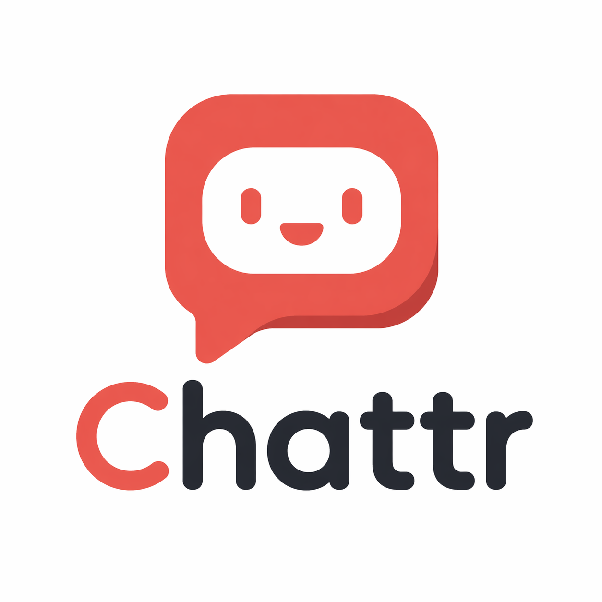
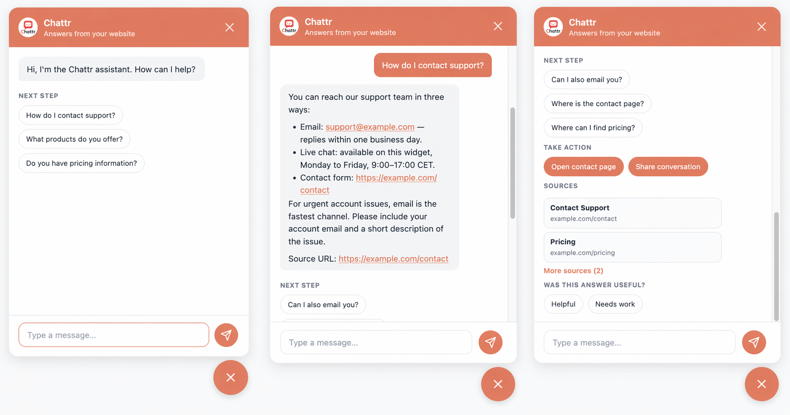

<p align="center">
  
</p>

<h1 align="center">Chattr</h1>

<p align="center">
  Open-source, self-hosted AI chatbot for support, docs, and customer questions on any website.<br>
  Add one <code>&lt;script&gt;</code> tag, connect your content, and launch a branded assistant with RAG, guardrails, and multi-tenant control.
</p>

<p align="center">
  <a href="https://github.com/Maxkrvo/Chattr/actions/workflows/ci.yml"></a>
  <a href="LICENSE"></a>
  
  
  
</p>

<p align="center">
  
</p>

## Why Teams Pick Chattr

- **Launch fast.** Add one script tag, scrape your site or ingest files, and go from blank widget to working assistant quickly.
- **Keep your stack and your data.** Self-host it, bring your own model, and run on SQLite + `sqlite-vec` without standing up a separate vector database.
- **Make it feel like your brand.** Theme the widget, tune the welcome copy, set starter questions, and control handoff actions.
- **Scale beyond one site.** Run multiple branded assistants from one deployment with isolated content, prompts, and guardrails.
- **Stay practical.** Ship with built-in prompt-injection detection, topic controls, output filtering, and per-tenant rate limits.

Built with [Hono](https://hono.dev), [Vercel AI SDK](https://sdk.vercel.ai), [sqlite-vec](https://github.com/asg017/sqlite-vec), and [Turborepo](https://turbo.build).

## Great Fit For

- **Support teams** that want fast answers on pricing, onboarding, returns, docs, or account questions.
- **Product and marketing teams** that want a branded AI assistant embedded on landing pages, docs, or help centers.
- **Agencies and multi-brand operators** that need one deployment serving many clients, regions, or business units.

## Quick Links

- [Why Teams Pick Chattr](#why-teams-pick-chattr)
- [Great Fit For](#great-fit-for)
- [Quick Start](#quick-start)
- [Widget Embed](#widget-embed)
- [Scraping](#scraping)
- [Docs](#docs)
- [Deployment](#deployment)
- [Contributing](CONTRIBUTING.md)

## Quick Start

Want a working local assistant fast? Requirements: Node.js 20+, pnpm 9+ (`corepack enable pnpm`).

```bash
git clone https://github.com/Maxkrvo/Chattr.git
cd Chattr
pnpm install
pnpm onboard
```

`pnpm onboard` is interactive. It asks for your model provider (OpenAI, Anthropic, Azure OpenAI, or Ollama), API key, brand settings, and a site URL to scrape. It writes `apps/server/.env` and rewrites `apps/server/src/instance/default/chattr.config.ts`, then offers to seed bundled demo content so the bot can answer questions right away. Re-run it any time to update your setup.

Want full control instead of the wizard? Copy `apps/server/.env.example` to `apps/server/.env`, edit `apps/server/src/instance/default/chattr.config.ts`, then run `pnpm seed-demo` to load bundled FAQ content (or `pnpm --filter @chattr/server scrape-ingest --tenant default` to scrape your own site).

Build and run:

```bash
pnpm build
pnpm start
```

Open `http://localhost:3000/demo.html` to see the widget locally.

### Providers

| Provider | Chat | Embeddings | Notes |
| -------- | :--: | :--------: | ----- |
| `openai` (default) | yes | yes | Works out of the box. |
| `anthropic` | yes | via OpenAI | Claude for chat, OpenAI for embeddings. |
| `azure-openai` | yes | yes | Set resource name and deployment names. |
| `ollama` | yes | yes | Any OpenAI-compatible local server. |

### Run Chattr fully local with zero API keys

Chattr also runs fully local against [Ollama](https://ollama.com) (or LM Studio, llama.cpp, vLLM). No keys, no bills, no data leaves your machine.

```bash
# 1. Install Ollama, then pull a chat and an embedding model:
ollama pull llama3.2
ollama pull nomic-embed-text

# 2. Install Chattr and pick `ollama` when onboard asks for a provider:
pnpm install
pnpm onboard

# 3. Build and run:
pnpm build && pnpm start
```

Open `http://localhost:3000/demo.html`. The bundled demo content is already embedded against your local Ollama so the bot answers immediately.

Switching embedding models later requires re-ingesting. Clear `./data/` first, then update `OLLAMA_EMBEDDING_MODEL` and `OLLAMA_EMBEDDING_DIMENSIONS` (see the [deployment guide](docs/deployment.md)).

## Widget Embed

For most sites, embedding Chattr is a one-script change:

```html
<script
  src="https://your-server.com/widget.js"
  data-server="https://your-server.com"
  defer
></script>
```

Useful attributes:

| Attribute | Purpose |
| --------- | ------- |
| `data-server` | Required. Chattr server URL. |
| `data-tenant` | Optional tenant ID (defaults to the server's default tenant). |
| `data-theme-primary` | Accent color override. |
| `data-theme-title` | Header title override. |
| `data-theme-subtitle` | Subtitle override. |
| `data-theme-avatar` | Avatar image URL override. |
| `data-language` | Force `en` or `nl`. |

If you want the widget to use tenant defaults (avatar, starter questions, escalation links), keep `data-tenant` aligned with the tenant keys in `apps/server/src/instance/default/chattr.config.ts`.

## Scraping

Feed Chattr from local files or let it crawl your site via sitemap-driven scraping.

Manual ingest:

```bash
pnpm --filter @chattr/server ingest ./path/to/docs
pnpm --filter @chattr/server ingest --tenant default ./path/to/docs
```

Scrape and ingest the default tenant:

```bash
pnpm --filter @chattr/server scrape-ingest --tenant default
```

Preview scraped pages without writing to the vector store:

```bash
pnpm --filter @chattr/server scrape-ingest --tenant default --dry-run
```

## Docs

- [Architecture and API](docs/architecture.md)
- [Multi-tenant guide](docs/multi-tenant.md)
- [Customizing Chattr](docs/customizing.md)
- [Deployment guide](docs/deployment.md)
- [Language support](docs/language.md)

## Deployment

Chattr is self-hosted. When you're ready to ship, Docker is the fastest path; Ubuntu VPS and reverse-proxy instructions live in [docs/deployment.md](docs/deployment.md).

### Docker

The image auto-seeds bundled demo content on first boot when a supported API key is present, so a fresh container responds to questions immediately.

```bash
docker build -t chattr .

docker run -p 3000:3000 \
  -e OPENAI_API_KEY=sk-... \
  -v chattr-data:/app/data \
  chattr
```

Open `http://localhost:3000/demo.html` to chat with the bot. Set `CHATTR_AUTOSEED=0` to skip the first-boot seed if you're restoring a database into the `chattr-data` volume.

## Development

```bash
cp apps/server/.env apps/server/.env.local
pnpm dev
```

Useful scripts:

- `pnpm build`
- `pnpm typecheck`
- `pnpm --filter @chattr/server check-retrieval -- --tenant default --query "How do I contact support?" --expect contact`
- `pnpm --filter @chattr/server report-chat-ops`

## Contributing

Contributions welcome. See [CONTRIBUTING.md](CONTRIBUTING.md) for local setup and PR guidelines.

## Security

Security issues are handled privately via GitHub Security Advisories. See [SECURITY.md](SECURITY.md) for reporting details and scope.

## License

[MIT](LICENSE)
